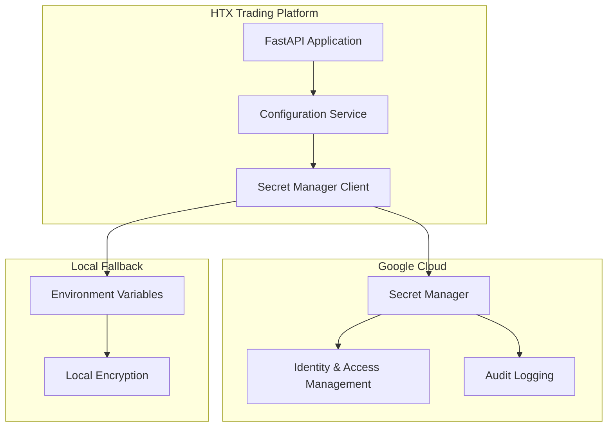

# HTX Trading Platform - API Keys Configuration Guide

## Overview

This document provides a comprehensive guide for configuring all required API keys for the HTX Trading Platform using Google Secret Manager for secure storage and management.

## Prerequisites

1. **Google Cloud Project**: Set up a GCP project with Secret Manager API enabled
2. **Service Account**: Create a service account with Secret Manager access
3. **Authentication**: Download service account key JSON file

## Required API Keys

### 1. HTX Exchange API Keys
**Priority**: HIGH - Required for core trading functionality

| Secret Name | Environment Variable | Description | Required |
|-------------|---------------------|-------------|----------|
| `htx-api-key` | `HTX_API_KEY` | HTX exchange API access key | ✅ Yes |
| `htx-api-secret` | `HTX_API_SECRET` | HTX exchange API secret key | ✅ Yes |
| `htx-subuid` | `HTX_SUBUID` | HTX sub-account user ID (optional) | ⚠️ Optional |

**How to obtain HTX API keys:**
1. Login to HTX exchange account
2. Go to Account > API Management
3. Create new API key with following permissions:
   - Read account information
   - Read trading history
   - Read order history (no trading permissions needed for analytics)
4. Copy API Key and Secret Key
5. If using sub-accounts, copy Sub-Account UID

### 2. OpenAI API Keys
**Priority**: MEDIUM - Required for ML analytics and insights

| Secret Name | Environment Variable | Description | Required |
|-------------|---------------------|-------------|----------|
| `openai-api-key` | `OPENAI_API_KEY` | OpenAI API key for ML services | ⚠️ Optional |

**How to obtain OpenAI API key:**
1. Visit https://platform.openai.com/api-keys
2. Login to OpenAI account
3. Create new API key
4. Copy the key (starts with sk-...)

### 3. 3Commas API Keys
**Priority**: LOW - Optional for extended trading bot integration

| Secret Name | Environment Variable | Description | Required |
|-------------|---------------------|-------------|----------|
| `threecommas-api-key` | `THREECOMMAS_API_KEY` | 3Commas API key | ❌ Optional |
| `threecommas-api-secret` | `THREECOMMAS_API_SECRET` | 3Commas API secret | ❌ Optional |

**How to obtain 3Commas API keys:**
1. Login to 3Commas account
2. Go to My Account > API keys
3. Create new API key with required permissions
4. Copy API Key and Secret

### 4. Google Cloud Service Keys
**Priority**: HIGH - Required for Secret Manager integration

| Secret Name | Environment Variable | Description | Required |
|-------------|---------------------|-------------|----------|
| `gcp-service-account-key` | `GOOGLE_APPLICATION_CREDENTIALS` | GCP service account JSON key | ✅ Yes |
| `gcp-project-id` | `GCP_PROJECT_ID` | Google Cloud Project ID | ✅ Yes |

## Google Secret Manager Setup

### Step 1: Enable Secret Manager API

```bash
# Enable Secret Manager API in your GCP project
gcloud services enable secretmanager.googleapis.com
```

### Step 2: Create Service Account

```bash
# Create service account
gcloud iam service-accounts create htx-secrets-manager \
    --description="HTX Trading Platform Secret Manager" \
    --display-name="HTX Secrets Manager"

# Grant Secret Manager permissions
gcloud projects add-iam-policy-binding YOUR_PROJECT_ID \
    --member="serviceAccount:htx-secrets-manager@YOUR_PROJECT_ID.iam.gserviceaccount.com" \
    --role="roles/secretmanager.admin"

# Create and download key file
gcloud iam service-accounts keys create htx-service-account.json \
    --iam-account=htx-secrets-manager@YOUR_PROJECT_ID.iam.gserviceaccount.com
```

### Step 3: Store Secrets in Google Secret Manager

Using Google Cloud Console or CLI:

```bash
# HTX API Keys
gcloud secrets create htx-api-key --data-file=-
# Enter your HTX API key when prompted

gcloud secrets create htx-api-secret --data-file=-
# Enter your HTX API secret when prompted

gcloud secrets create htx-subuid --data-file=-
# Enter your HTX sub-account UID when prompted (optional)

# OpenAI API Key
gcloud secrets create openai-api-key --data-file=-
# Enter your OpenAI API key when prompted

# 3Commas API Keys (optional)
gcloud secrets create threecommas-api-key --data-file=-
gcloud secrets create threecommas-api-secret --data-file=-
```

### Step 4: Configure Environment Variables

Create or update your `.env` file in the backend directory:

```env
# Google Cloud Configuration
GCP_PROJECT_ID=your-gcp-project-id
GOOGLE_APPLICATION_CREDENTIALS=path/to/htx-service-account.json
USE_SECRET_MANAGER=true

# Fallback environment variables (for development)
HTX_API_KEY=your-htx-api-key
HTX_API_SECRET=your-htx-secret-key
HTX_SUBUID=your-htx-subuid
OPENAI_API_KEY=your-openai-key
THREECOMMAS_API_KEY=your-3commas-key
THREECOMMAS_API_SECRET=your-3commas-secret

# Encryption key for local storage (generate using Fernet.generate_key())
ENCRYPTION_KEY=your-local-encryption-key
```

## Security Best Practices

### 1. Access Control
- Use IAM roles to limit access to secrets
- Create separate service accounts for different environments
- Regularly rotate API keys

### 2. Encryption
- All secrets are encrypted at rest in Google Secret Manager
- Local fallback uses Fernet encryption
- Never commit secrets to version control

### 3. Monitoring
- Enable audit logging for secret access
- Monitor for unauthorized access attempts
- Set up alerts for secret modifications

### 4. Environment Separation
- Use different Secret Manager projects for dev/staging/prod
- Implement proper secret versioning
- Test secret rotation procedures

## Secret Manager Integration Architecture



## Frontend Setup Wizard Requirements

The frontend should implement a setup wizard that:

1. **Validates GCP Configuration**
   - Checks service account credentials
   - Verifies Secret Manager access
   - Tests project ID connectivity

2. **API Key Management Interface**
   - Secure form for entering API keys
   - Real-time validation of key formats
   - Test connectivity for each service

3. **Status Dashboard**
   - Display current secret status
   - Show last update timestamps
   - Indicate which services are configured

4. **Security Features**
   - No storage of keys in browser
   - Masked display of sensitive data
   - Secure transmission to backend

## Troubleshooting

### Common Issues

1. **Secret Manager Access Denied**
   - Verify service account permissions
   - Check IAM roles assignment
   - Ensure API is enabled

2. **HTX API Connection Failed**
   - Verify API key validity
   - Check HTX API status
   - Confirm API permissions

3. **OpenAI API Errors**
   - Validate API key format
   - Check account billing status
   - Verify rate limits

### Validation Commands

```bash
# Test Secret Manager access
gcloud secrets versions access latest --secret="htx-api-key"

# Test HTX API connectivity
curl -H "AccessKeyId: YOUR_KEY" -H "SignatureMethod: HmacSHA256" \
     "https://api.huobi.pro/v1/account/balance"

# Test OpenAI API
curl -H "Authorization: Bearer YOUR_OPENAI_KEY" \
     "https://api.openai.com/v1/models"
```

## Implementation Checklist

### Backend Implementation
- [ ] Secret Manager client integration
- [ ] Configuration service with fallback
- [ ] API key validation endpoints
- [ ] Secret rotation support
- [ ] Error handling and logging

### Frontend Implementation
- [ ] Setup wizard component
- [ ] API key management interface
- [ ] Service status dashboard
- [ ] Secure form handling
- [ ] Real-time validation

### Security Implementation
- [ ] IAM permissions configured
- [ ] Audit logging enabled
- [ ] Local encryption setup
- [ ] Secret rotation procedures
- [ ] Access monitoring

### Testing
- [ ] Unit tests for secret management
- [ ] Integration tests with GCP
- [ ] API connectivity validation
- [ ] Security testing
- [ ] Error scenario testing

---

**Note**: This configuration ensures secure, scalable management of all API keys required for the HTX Trading Platform while providing fallback mechanisms for development and testing environments.