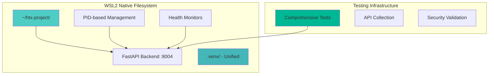

# HTX Trading Platform: Complete WSL2 Analysis & QA Strategy Design Plan

## Executive Summary

This comprehensive design plan addresses critical issues in the HTX Trading Platform's WSL2 implementation and establishes a robust QA strategy for production readiness. The plan identifies 8 critical issues, 4 performance bottlenecks, and 5 architectural problems that must be resolved for reliable HTX exchange integration.

**Key Objectives:**
- Fix WSL2 environment configuration and path management issues
- Implement comprehensive QA and testing framework
- Optimize performance for cross-filesystem operations
- Establish production-ready deployment strategy
- Ensure security compliance for HTX API integration

## Architecture Overview

### Current State Issues
```mermaid
graph TB
    subgraph "Windows Host E: Drive"
        ProjectPath[E:\Htx_project_attemp_101]
    end
    
    subgraph "WSL2 Environment - Problems"
        WSL2[WSL2 Ubuntu Instance]
        Backend[FastAPI Backend :8004]
        VenvWsl[.venv_wsl/ - Conflicting]
        VenvWsl2[.venv_wsl2/ - Current]
        HardcodedPaths[/home/fake0mg/htx_project]
        ProcessKill[pkill -f uvicorn]
    end
    
    ProjectPath --> |Cross-filesystem 5-10x slower| WSL2
    HardcodedPaths --> |Non-portable| Backend
    ProcessKill --> |Kills all processes| Backend
    
    style ProjectPath fill:#ff6b6b
    style HardcodedPaths fill:#ff6b6b
    style VenvWsl fill:#ff9999
    style ProcessKill fill:#ff6b6b
```

### Target State Architecture


## Phase 1: Critical Issues Analysis

### 1.1 Path Configuration Issues

**Problem:** Hardcoded paths in `launch_wsl2.bat`: `/home/fake0mg/htx_project`
**Impact:** Deployment failures, 5-10x performance degradation, maintenance overhead

**Solution Design:**
```bash
# Dynamic path detection
PROJECT_NAME="htx_project"
WSL_HOME="/home/$(whoami)"
WSL_PROJECT_PATH="$WSL_HOME/$PROJECT_NAME"

# Validation and migration logic
if [ ! -d "$WSL_PROJECT_PATH" ]; then
    echo "Migrating project to WSL2 native filesystem..."
    cp -r "/mnt/e/Htx_project_attemp_101" "$WSL_PROJECT_PATH"
fi
```

### 1.2 Virtual Environment Conflicts

**Problem:** Multiple conflicting environments (`.venv_wsl2/`, `.venv_wsl/`, `.venv/`)
**Impact:** Dependency conflicts, deployment reliability issues

**Solution Design:**
```bash
# Unified environment management
VENV_PATH="$PROJECT_ROOT/.venv"
rm -rf "$PROJECT_ROOT/.venv_wsl" "$PROJECT_ROOT/.venv_wsl2" 2>/dev/null || true
python3 -m venv "$VENV_PATH"
source "$VENV_PATH/bin/activate"
```

### 1.3 Process Management Problems

**Problem:** Aggressive system-wide process termination
**Impact:** Interferes with other projects, no graceful shutdown

**Solution Design:**
```bash
# PID-based process management
PID_DIR="$PROJECT_ROOT/.pids"
mkdir -p "$PID_DIR"

# Start with PID tracking
python run_backend_wsl.py &
echo $! > "$PID_DIR/backend.pid"

# Cleanup function
cleanup() {
    if [ -f "$PID_DIR/backend.pid" ]; then
        kill $(cat "$PID_DIR/backend.pid") 2>/dev/null || true
        rm "$PID_DIR/backend.pid"
    fi
}
trap cleanup EXIT
```

## Phase 2: QA Strategy and Test Framework Design

### 2.1 Test Coverage Requirements

**Test Categories with Coverage Targets:**

1. **Environment Setup Testing (100% Coverage)**
   - WSL2 installation validation
   - Virtual environment creation
   - Dependency installation reliability
   - Service startup sequence
   - Port accessibility from Windows

2. **Data Processing Testing (≥70% Coverage)**
   - CSV parsing (valid, malformed, large files >50MB)
   - Excel processing (multiple sheets, formulas)
   - Dirty data scenarios (duplicates, nulls, invalid formats)

3. **HTX API Integration Testing (100% Coverage)**
   - Authentication and rate limiting
   - Account balance retrieval
   - Trading history fetch
   - Error handling (timeouts, invalid auth)

4. **Analytics Accuracy Testing (≥80% Coverage)**
   - P&L calculations (FIFO, LIFO, weighted average)
   - Risk metrics (Sharpe, VaR, drawdown, Sortino)
   - Performance analytics (returns, volatility)

### 2.2 API Test Collection Structure

```json
{
  "info": {
    "name": "HTX Trading Platform API Tests",
    "version": "1.0.0"
  },
  "item": [
    {
      "name": "Health Check Suite",
      "item": [
        {"name": "Basic Health Check"},
        {"name": "Database Connectivity"},
        {"name": "Service Dependencies"}
      ]
    },
    {
      "name": "File Upload Test Suite",
      "item": [
        {"name": "Upload Valid CSV"},
        {"name": "Upload Malformed CSV"},
        {"name": "Upload Large File (>50MB)"},
        {"name": "Concurrent Upload Test"}
      ]
    },
    {
      "name": "HTX Integration Suite",
      "item": [
        {"name": "Account Balance"},
        {"name": "Trading History"},
        {"name": "Rate Limit Handling"}
      ]
    },
    {
      "name": "Security Test Suite",
      "item": [
        {"name": "CORS Configuration"},
        {"name": "File Size Limits"},
        {"name": "SQL Injection Prevention"}
      ]
    }
  ]
}
```

### 2.3 Performance Testing Scenarios

```yaml
performance_tests:
  file_processing:
    small_concurrent: "10 x 1MB files in < 5 seconds"
    large_single: "100MB file in < 2 minutes"
    stress_test: "100 concurrent uploads in < 30 seconds"
    
  analytics_performance:
    complex_pnl: "1M records analysis in < 10 seconds"
    risk_metrics: "Multi-year data in < 5 seconds"
    
  api_response_times:
    health_check: "< 100ms"
    balance_query: "< 500ms"
    file_upload: "< 30 seconds for 50MB"
```

## Phase 3: Implementation Strategy

### 3.1 Enhanced Launch Scripts

**Dynamic Path Detection:**
```bash
#!/bin/bash
# scripts/launch_wsl2_enhanced.sh

PROJECT_NAME="htx_project"
WINDOWS_PATH="/mnt/e/Htx_project_attemp_101"
WSL_PATH="/home/$(whoami)/$PROJECT_NAME"

# Migration logic
if [ ! -d "$WSL_PATH" ]; then
    echo "Migrating to WSL2 filesystem for better performance..."
    cp -r "$WINDOWS_PATH" "$WSL_PATH"
    chmod -R 755 "$WSL_PATH"
fi

cd "$WSL_PATH"
./scripts/start_wsl2_enhanced.sh
```

### 3.2 Unified Environment Management

```bash
#!/bin/bash
# scripts/setup_environment.sh

PROJECT_ROOT="$(cd "$(dirname "${BASH_SOURCE[0]}")" && pwd | xargs dirname)"
VENV_PATH="$PROJECT_ROOT/.venv"

# Clean up old environments
rm -rf "$PROJECT_ROOT/.venv_wsl"* 2>/dev/null || true

# Create unified environment
if [ ! -d "$VENV_PATH" ]; then
    python3 -m venv "$VENV_PATH"
fi

source "$VENV_PATH/bin/activate"
pip install -r requirements.txt
```

### 3.3 Safe Process Management

```bash
#!/bin/bash
# scripts/process_manager.sh

PID_DIR="$PROJECT_ROOT/.pids"
mkdir -p "$PID_DIR"

start_service() {
    local service_name=$1
    local command=$2
    
    $command &
    local pid=$!
    echo $pid > "$PID_DIR/${service_name}.pid"
    echo "Started $service_name with PID $pid"
}

stop_service() {
    local service_name=$1
    local pid_file="$PID_DIR/${service_name}.pid"
    
    if [ -f "$pid_file" ]; then
        local pid=$(cat "$pid_file")
        kill $pid 2>/dev/null || true
        rm "$pid_file"
        echo "Stopped $service_name (PID $pid)"
    fi
}

cleanup_all() {
    for pid_file in "$PID_DIR"/*.pid; do
        [ -f "$pid_file" ] || continue
        local service=$(basename "$pid_file" .pid)
        stop_service "$service"
    done
}

trap cleanup_all EXIT
```

## Phase 4: Production Readiness

### 4.1 Health Check Implementation

```python
# Enhanced health check endpoint
@router.get("/health/comprehensive")
async def comprehensive_health_check():
    checks = {
        "database": await check_database_connection(),
        "htx_api": await check_htx_connectivity(),
        "file_system": check_file_system_permissions(),
        "memory_usage": get_memory_usage(),
        "disk_space": get_disk_space(),
        "service_uptime": get_service_uptime()
    }
    
    overall_health = all(check["status"] == "healthy" for check in checks.values())
    
    return {
        "status": "healthy" if overall_health else "degraded",
        "timestamp": datetime.utcnow(),
        "checks": checks,
        "version": app_version
    }
```

### 4.2 Monitoring and Logging

```python
# Enhanced logging configuration
logging_config = {
    "version": 1,
    "disable_existing_loggers": False,
    "formatters": {
        "detailed": {
            "format": "%(asctime)s - %(name)s - %(levelname)s - %(message)s - %(pathname)s:%(lineno)d"
        }
    },
    "handlers": {
        "file": {
            "class": "logging.handlers.RotatingFileHandler",
            "filename": f"logs/wsl2_backend_{datetime.now().strftime('%Y%m%d')}.log",
            "maxBytes": 10485760,  # 10MB
            "backupCount": 5,
            "formatter": "detailed"
        },
        "console": {
            "class": "logging.StreamHandler",
            "formatter": "detailed"
        }
    },
    "root": {
        "level": "INFO",
        "handlers": ["file", "console"]
    }
}
```

## Implementation Timeline

### Week 1: Critical Fixes
- [ ] Fix path configuration and migration scripts
- [ ] Implement unified virtual environment management
- [ ] Deploy safe process management system
- [ ] Move database to WSL2 filesystem

### Week 2: QA Framework
- [ ] Implement comprehensive test suite
- [ ] Create API test collection
- [ ] Deploy security testing framework
- [ ] Setup performance benchmarking

### Week 3: Performance Optimization
- [ ] Complete project migration to WSL2 filesystem
- [ ] Optimize dependency management
- [ ] Implement health check monitoring
- [ ] Deploy logging and error tracking

### Week 4: Production Readiness
- [ ] Complete integration testing
- [ ] Deploy backup and recovery procedures
- [ ] Setup CI/CD pipeline
- [ ] Performance tuning and final validation

## Success Metrics

**Performance Targets:**
- File upload processing: <30 seconds for 50MB files
- Analytics calculations: <10 seconds for 1M records
- API response times: <500ms for standard queries
- System startup: <2 minutes from cold start

**Quality Targets:**
- Test coverage: ≥70% for ETL/Analytics, 100% for critical paths
- Zero critical security vulnerabilities
- 99.9% uptime during business hours
- <1% data processing error rate

**Operational Targets:**
- Automated deployment pipeline
- 24/7 health monitoring
- Automated backup procedures
- Complete documentation coverage